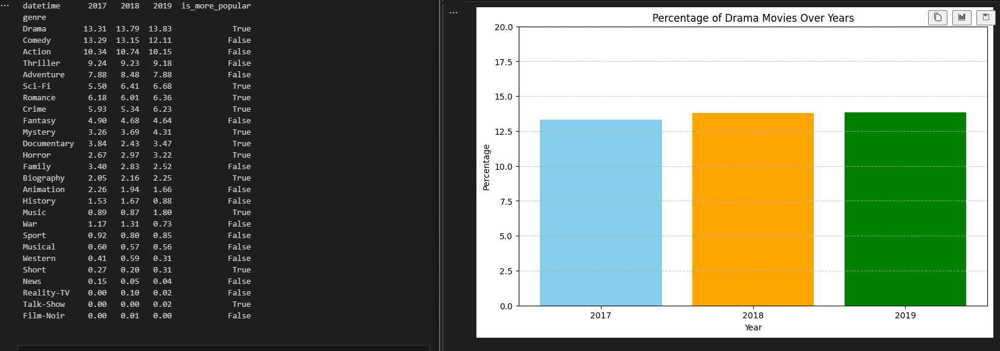

## Table of contents

- [General info](#general-info)
- [Technologies](#technologies)
- [How to install](#how-to-install)
- [Screenshots](#screenshots)

## General info

Netflix watched positions data analysis.

## Technologies

Used technologies:

- Python
- Pandas
- Juoyter Notebook
- Matplotlib

Used also:

- venv

- ## How to install

To run this notebook interactively:

1. Download this repository in a zip file by clicking on this [link](https://github.com/Zasada94/vod_data_analysis/achive/master.zip) or execute this from the terminal:
`git clone https://github.com/Zasada94/vod_data_analysis.git`
2. Install [virtualenv](http://virtualenv.readthedocs.org/en/latest/installation.html).
3. Navigate to the directory where you unzipped or cloned the repo and create a virtual environment with `virtualenv env`.
4. Activate the environment with `source env/bin/activate`.
5. Install the required dependencies with `pip install -r requirements.txt`.
6. Execute `ipython notebook` from the command line or terminal and  click on `project.ipynb` in the IPython Notebook dashboard and enjoy!
7. When you're done deactivate the virtual environment with `deactivate`.

## Screenshots

